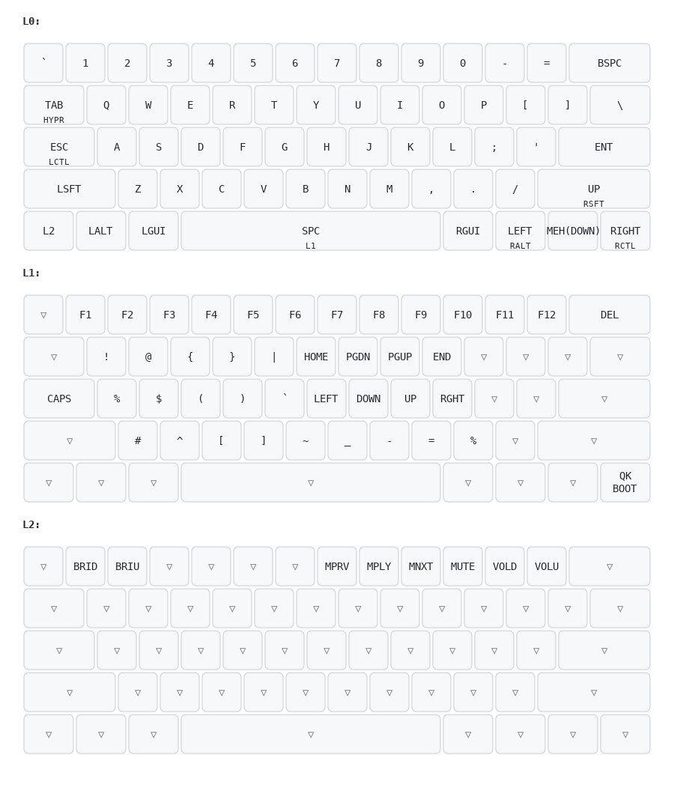

# Dev-Focused 60% ANSI layout

## How to compile this layout

Install QMK of MacOS seems to be a bit tricky.
Few C compilation errors appear when doing `qmk setup`.
Luckily, QMK provides a Docker image.

First, clone the [QMK project](https://github.com/qmk/qmk_firmware/).

Then, run the image and create a new keymap for the desired keyboard.
In this case, we create a keymap called `giograno` for the `cannonkeys/db60/hotswap` keyboard.

```shell
docker run -it -v "$(pwd)":/qmk-firmware ghcr.io/qmk/qmk_cli /bin/bash
cd qmk-firmware
qmk new-keymap -kb cannonkeys/db60/hotswap -km giograno
```

In the repo, a folder is created under `keyboards/cannonkeys/db60/hotswap/giograno` containing a `keymap.c` file.
This is the file to modify to get the layout you want.

Now, compile the new layout with:

```shell
qmk compile -kb cannonkeys/db60/hotswap -km giograno
```

This command will give a `.bin` file in output (in our case a file named `cannonkeys_db60_hotswap_giograno.bin`) and some `hex` files in `./build`).

Unfortunately, it is not possible to flash from a Docker container on MacOs directly to the keyboard.
So, rely on [QMK toolbox](https://github.com/qmk/qmk_toolbox).
At first, put the keyboard in bootloader mode (just set the PCB to 1).
QMK toolbox should now see the keyboard.
Select `cannonkeys_db60_hotswap_giograno.bin` and flash it. 
This is it!

## Layout

Here is an image of the entire layout.



## Some tricks

- In a 60% layout, it is nice to keep the arrows still as a dedicated keys in the buttom right of the keyboard. All the keys there have only a hold function, so the tap is free to use;
- Spacebar is used to access the symbol layer. The second layer gives access to the F keys, arrows VIM mode and a bunch of symbols that can be accessed more easily (I took this strategy from [Fatih Arslan](https://arslan.io/2022/10/22/review-of-the-kinesis-advantage360-professional/).

To print the picture of the layout, I used https://keymap-drawer.streamlit.app/.
This website takes in input a json file that can be exported from `keymap.c` with the following command:

```
qmk c2json -kb cannonkeys/db60/hotswap -km giograno keyboards/cannonkeys/db60/keymaps/giograno/keymap.c >> keymap.json
```

The `keymap.json` file is in this repo as well.

